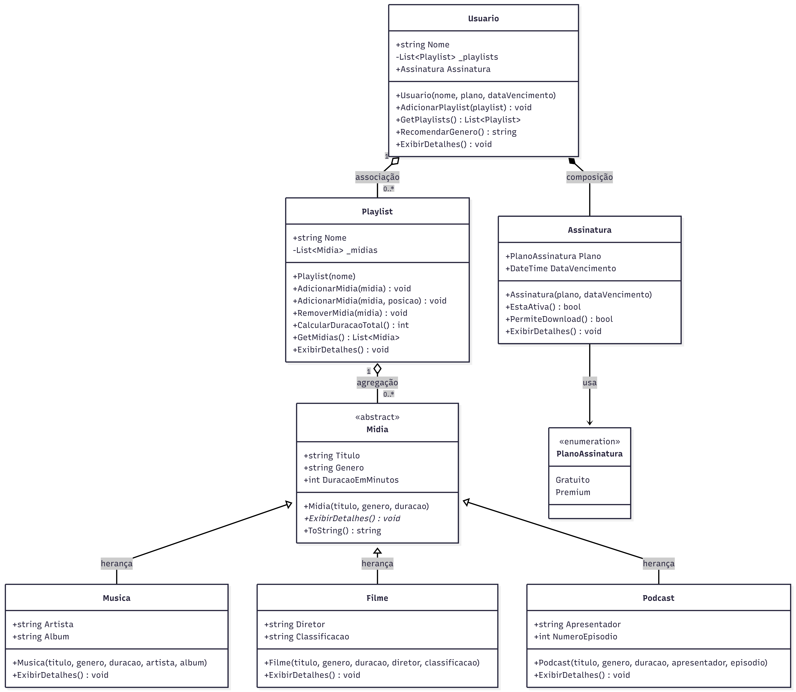

# StreamingMidia

Trabalho final da disciplina de Programação Orientada a Objetos — UPF.

## Integrantes

- Hyago Tonelli
- Henrique Prediger

## Linguagem

C# com .NET 8.0

C# é uma linguagem orientada a objetos criada pela Microsoft em 2000, fortemente inspirada no Java. Roda sobre a plataforma .NET, que é multiplataforma (Windows, Linux, macOS). Por ser muito próxima do Java em sintaxe e paradigma, foi escolhida para este trabalho, permitindo aplicar os mesmos conceitos de OOP estudados em aula com algumas diferenças relevantes:

- **Properties** (`{ get; set; }`) substituem os métodos getter e setter verbosos do Java
- **`virtual` e `override`** são explícitos — em Java basta a anotação `@Override`, em C# é necessário declarar `virtual` na classe pai e `override` na filha
- **LINQ** permite operações em coleções como `GroupBy`, `Sum` e `SelectMany` de forma declarativa, sem loops manuais
- **`DateTime`** é um tipo nativo, sem necessidade de imports adicionais

C# é amplamente utilizado no mercado para desenvolvimento de jogos (Unity), aplicações Windows, APIs com ASP.NET e aplicações mobile com MAUI.

## Estudo de caso

Sistema de streaming de mídia que permite gerenciar usuários, playlists e diferentes tipos de conteúdo. O sistema simula funcionalidades básicas de plataformas como Spotify e Netflix, incluindo controle de assinatura, organização de playlists e recomendação de conteúdo por gênero.

## Estrutura das classes

```
StreamingMidia/
├── Domain/
│   ├── Midia.cs          # Classe abstrata base
│   ├── Musica.cs         # Herda de Midia
│   ├── Filme.cs          # Herda de Midia
│   ├── Podcast.cs        # Herda de Midia
│   ├── Assinatura.cs     # Composição com Usuario
│   ├── Usuario.cs        # Classe principal
│   └── Playlist.cs       # Agrega Midia
└── Program.cs            # Fluxo de execução com menu interativo
```

## Requisitos de OOP atendidos

| Requisito | Implementação |
|---|---|
| Herança | `Musica`, `Filme` e `Podcast` herdam de `Midia` |
| Composição | `Usuario` cria e gerencia sua própria `Assinatura` |
| Associação | `Usuario` se associa a zero ou mais `Playlist` |
| Agregação | `Playlist` agrega zero ou mais objetos `Midia` |
| Classe abstrata | `Midia` com método abstrato `ExibirDetalhes()` |
| Polimorfismo | Cada subclasse implementa `ExibirDetalhes()` de forma própria |
| Sobrecarga | `AdicionarMidia(midia)` e `AdicionarMidia(midia, posicao)` em `Playlist` |
| Enumeração | `PlanoAssinatura` com valores `Gratuito` e `Premium` |

## Regras de negócio

- `PermiteDownload()` — verifica se o plano é Premium e se a assinatura está ativa
- `CalcularDuracaoTotal()` — soma a duração de todas as mídias de uma playlist
- `RecomendarGenero()` — analisa todas as playlists do usuário e retorna o gênero mais presente

## Como executar

**Pré-requisitos:** .NET 8.0 SDK instalado.

```bash
git clone https://github.com/seu-usuario/StreamingMidia.git
cd StreamingMidia
dotnet run
```

Ao executar, um menu interativo será exibido no console com as seguintes opções:

1. Listar usuários
2. Ver playlists de um usuário
3. Ver detalhes de uma playlist
4. Verificar permissão de download
5. Recomendar gênero
6. Adicionar mídia à playlist

## Diagrama de classes

